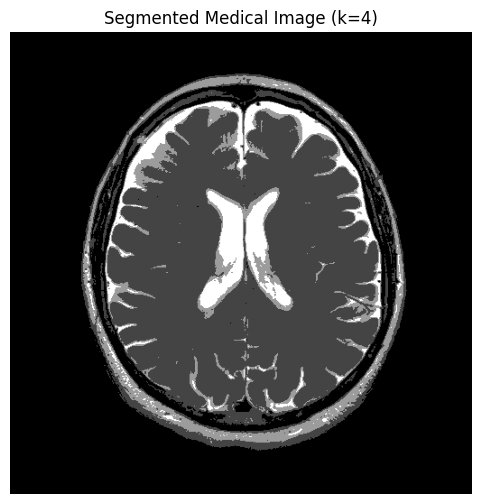
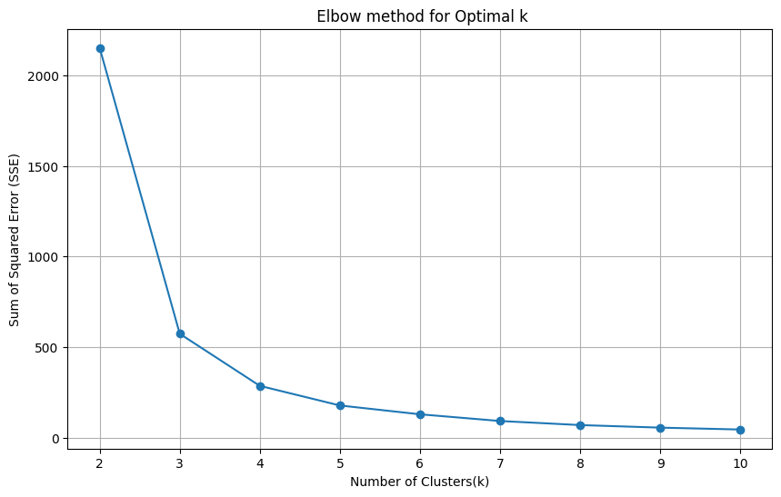

# Image Segmentation using K-Means

This project demonstrates image segmentation using **K-Means clustering** on both
RGB images and medical (DICOM) images with visual results.

---

## Table of Contents
- [Overview](#overview)
- [Requirements](#requirements)
- [Medical Image Segmentation](#medical-image-segmentation)
- [Elbow Method](#elbow-method)
- [How to Run](#how-to-run)

---

## Overview

K-Means clustering is an unsupervised learning algorithm that groups pixels based on
similarity, allowing images to be segmented into meaningful regions.

---

## Requirements

Install the required libraries:

~~~bash
pip install numpy matplotlib scikit-learn pillow pydicom
~~~

---

## Medical Image Segmentation

### Original Medical Image

### Segmented Medical Image (k = 4)

---

## Elbow Method

The Elbow Method is used to determine the optimal number of clusters by plotting
the Sum of Squared Errors (SSE).

---

## How to Run

1. Update the image paths in the Python script  
2. Run the program:

---

